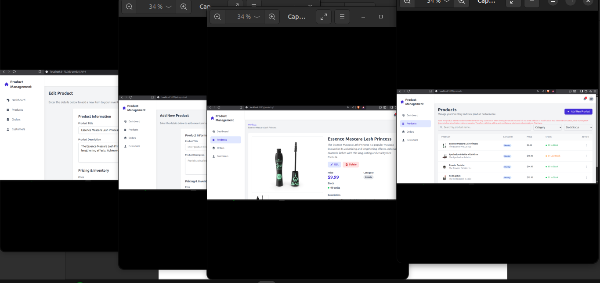

# 📦 Vue 3 Product Manager Dashboard

A modern, responsive Product Management Dashboard built with **Vue 3**, **Vite**, **Tailwind CSS**, and **Pinia**. This application interacts with the [DummyJSON API](https://dummyjson.com/) to simulate a real-world inventory management system.




## ✨ Features

### 🔐 Authentication & Security
- **Simulated Login System:** Uses DummyJSON auth endpoint.
- **JWT Persistence:** Keeps the user logged in via `localStorage`.
- **Route Protection:** Global navigation guards prevent access to internal pages without a valid token.
- **Layout Management:** Dynamic switching between "Auth Layout" (Login) and "Dashboard Layout" (Sidebar + Header).

### 📊 Product Management
- **Data Fetching:** Retrieves real product data from the API.
- **Optimized Pagination:** Client-side pagination (blocks of 4 items).
- **Advanced Filtering:**
  - Real-time search by name.
  - Filter by Category.
  - Filter by Stock size.
  - Visual Stock Status indicators (In Stock, Low Stock, Out of Stock).
- **Responsive Table:** Custom-styled table with scroll management (`hide-scrollbar`).

### 🛠 CRUD Operations (Simulated)
Due to the nature of the mock API, this project uses **Optimistic UI updates**:
- **Create:** Adds a new product to the local state immediately.
- **Read:** View detailed product information, images, and ratings.
- **Update:** Edit product details (Title, Price, Stock, Description) with local state updates.
- **Delete:** Remove items with a **Confirmation Modal** context menu.

## 🚀 Getting Started

### Prerequisites
- Node.js (v16.0 or higher)
- npm or yarn

### Installation

1. **Clone the repository**
   ```bash
   git clone https://github.com/malikdevz/ProductManagerApp.git
   cd ProductManagerApp
   ```

2. **Install dependencies**
   ```bash
   npm install
   ```

3. **Start the development server**
   ```bash
   npm run dev
   ```

4. **Build for production**
   ```bash
   npm run build
   ```

## ⚠️ Important Note on Data Persistence

This application uses **DummyJSON** as its backend.
*   **Read Operations:** Data is real and comes from the server.
*   **Write Operations (Add/Edit/Delete):** The API **simulates** a success response but **does not actually change the database** on the server.

**Solution:** I have implemented a robust **Pinia Store logic** that updates the local UI state immediately.
> *If you refresh the page (F5), the data will reset to the original server state. This is expected behavior for a mock API demo.*

## 📂 Project Structure

```
src/
├── assets/          # Static assets (CSS, Images)
├── components/      # Reusable UI components
├── router/          # Vue Router configuration
├── stores/          # Pinia State Management (Auth & Product)
├── views/           # Page components (Login, ProductList, Details...)
├── App.vue          # Main Root Component
└── main.js          # Entry point
```

## 🛠 Tech Stack

- **Framework:** [Vue.js 3](https://vuejs.org/) (Composition API & Script Setup)
- **Build Tool:** [Vite](https://vitejs.dev/)
- **Styling:** [Tailwind CSS](https://tailwindcss.com/)
- **State Management:** [Pinia](https://pinia.vuejs.org/)
- **Routing:** [Vue Router 4](https://router.vuejs.org/)
- **HTTP Client:** [Axios](https://axios-http.com/)

## 📝 License

This project is open-source and available under the [MIT License](LICENSE).

# 📘 Technical Documentation

This document explains the architectural decisions and logic implementation of the Product Manager Dashboard.

## 1. Authentication Flow

The authentication system is designed to mimic a real production environment, despite using a mock API.

*   **Store (`stores/auth.js`):**
    *   The `token` is initialized from `localStorage` to persist sessions across refreshes.
    *   A getter `isAuthenticated` checks both the Pinia state and LocalStorage to ensure the Router doesn't block valid users during the initial app load.
*   **Router (`router/index.js`):**
    *   Uses `router.beforeEach` to check `to.meta.requiresAuth`.
    *   Redirects unauthenticated users to `/login`.
    *   Redirects already logged-in users away from `/login` to `/products`.

## 2. Product State Management (Pinia)

Since DummyJSON is read-only for write operations, the `product` store acts as the "Single Source of Truth" for the UI.

### The "Optimistic UI" Pattern
When a user modifies data (Delete/Edit/Add), we update the UI *before* or *simulated alongside* the API response.

*   **Deleting:**
    We send the DELETE request to check for network errors, then filter the local array:
    ```javascript
    this.products = this.products.filter(p => p.id !== id);
    ```

*   **Adding:**
    We send the POST request, receive the mock object, and `unshift` it to the top of the array:
    ```javascript
    this.products.unshift({ ...response.data, id: Date.now() });
    ```

*   **Editing:**
    We find the index of the product in the array and merge the new data:
    ```javascript
    this.products[index] = { ...this.products[index], ...updatedData };
    ```

## 3. UI/UX Implementation Details

### Pagination Logic
Instead of asking the API for page 1, 2, 3 (Server-side pagination), we fetch all products once and handle pagination **Client-side**.
*   **Why?** It allows for instant filtering and searching without re-fetching data.
*   **Implementation:** Used Vue `computed` properties (`paginatedProducts`) to slice the main array based on `currentPage` and `itemsPerPage`.

### Context Menus & Modals
*   **Context Menu:** Implemented using a relative positioning system within the table cell. Uses `@click.stop` modifiers to prevent triggering the row navigation event when clicking the action button.
*   **Delete Modal:** A global state in the View controls the visibility of the modal. It acts as a safety barrier before executing the `deleteProduct` action.

### Styling Tricks
*   **Sidebar Layout:** The layout logic relies on `route.meta.layout`. `App.vue` checks this meta field to decide whether to render the Sidebar/Header or just the full-screen Login view.
*   **Scrollbar Hiding:** A custom utility class `.hide-scrollbar` was added to `style.css` (or scoped style) to keep the UI clean while maintaining scroll functionality on smaller screens.

## 4. Reusability

*   **Form Reusability:** The `AddProductView.vue` component handles both **Creation** and **Edition**.
    *   It checks for an `id` in the URL query parameters (`route.query.id`).
    *   If an ID exists, it prefills the form with data from the store.
    *   On submit, it dynamically calls either `updateProduct` or `addProduct`.

## 5. Future Improvements

If this were a production app, the following would be added:
*   **Server-Side Pagination:** For datasets larger than 100 items.
*   **Form Validation:** Using a library like Vuelidate or Zod.
*   **Toast Notifications:** To give visual feedback on success/error instead of just console logs.
```